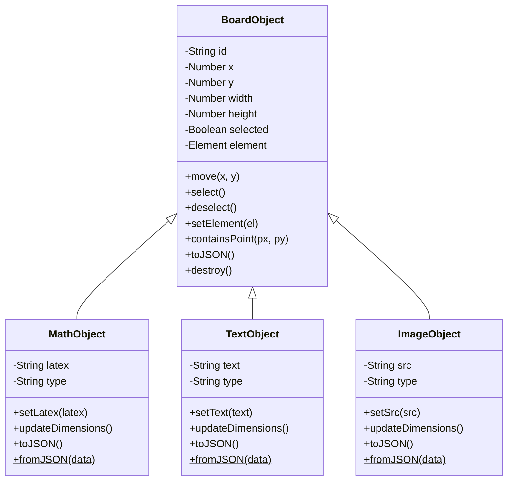
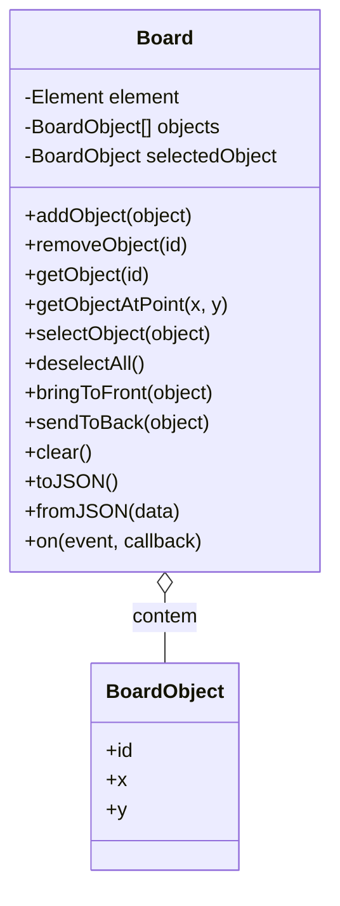
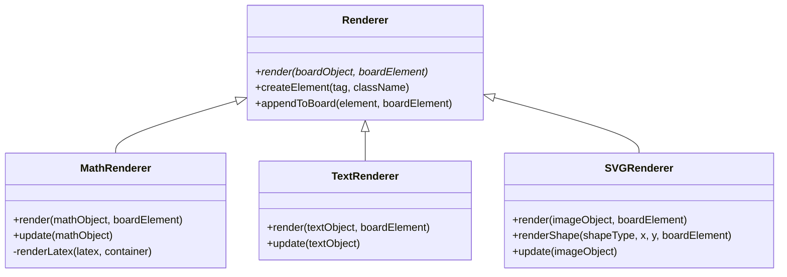
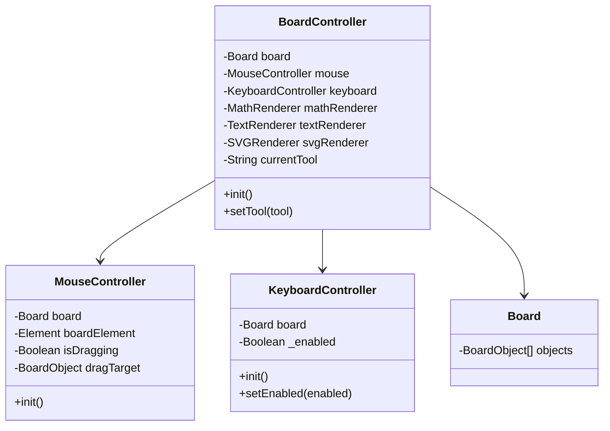
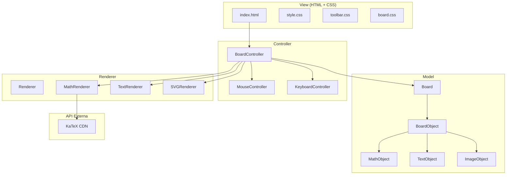

# Lousa Online - Matematica

Aplicacao web para lousa online com suporte a expressoes matematicas (LaTeX), textos, imagens SVG e formas geometricas. Desenvolvida com HTML, CSS, JavaScript e KaTeX.

## Funcionalidades

- **Equacoes LaTeX**: Clique na lousa, insira uma expressao em LaTeX e veja-a renderizada em tempo real via KaTeX
- **Textos livres**: Adicione e edite textos diretamente na lousa (edicao inline)
- **Imagens SVG**: Insira imagens vetoriais por URL
- **Formas geometricas**: Triangulo, circulo e retangulo
- **Arrastar objetos**: Mova qualquer elemento com o mouse
- **Duplo-clique**: Edite equacoes e textos existentes
- **Menu contexto**: Botao direito para editar, duplicar, ordenar e excluir
- **Salvar/Carregar**: Exporte e importe a lousa como JSON
- **Atalhos de teclado**: `V` Selecionar, `E` Equacao, `T` Texto, `I` Imagem, `Del` Excluir, `Esc` Cancelar

## Estrutura de Pastas

```
PI/
├── index.html                          # Pagina principal
├── css/
│   ├── style.css                       # Estilos globais, modal, menu contexto
│   ├── toolbar.css                     # Estilos da barra lateral de ferramentas
│   └── board.css                       # Estilos da lousa e objetos
├── js/
│   ├── app.js                          # Inicializacao e eventos de save/load/clear
│   ├── models/
│   │   ├── BoardObject.js              # Classe base para todos os objetos
│   │   ├── MathObject.js               # Modelo de equacao LaTeX
│   │   ├── TextObject.js               # Modelo de texto livre
│   │   └── ImageObject.js              # Modelo de imagem SVG
│   ├── board/
│   │   └── Board.js                    # Gerenciador de colecao de objetos
│   ├── renderers/
│   │   ├── Renderer.js                 # Classe base abstrata para renderizacao
│   │   ├── MathRenderer.js             # Renderizacao de equacoes via KaTeX
│   │   ├── TextRenderer.js             # Renderizacao de textos
│   │   └── SVGRenderer.js              # Renderizacao de imagens e formas SVG
│   └── controllers/
│       ├── BoardController.js          # Controller principal (coordena tudo)
│       ├── MouseController.js          # Eventos de mouse (clique, arrasto, duplo-clique)
│       └── KeyboardController.js       # Atalhos de teclado
└── assets/
    └── svg/                            # Repositorio de imagens SVG
```

## Arquitetura

O projeto segue o padrao **MVC** (Model-View-Controller) com separacao entre dados, renderizacao e controle de interacao.

### Visao Geral

```
┌─────────────────────────────────────────────┐
│              INTERFACE (HTML + CSS)          │
│   Toolbar  |  Modal Editor  |  Area Lousa   │
└─────────────────────┬───────────────────────┘
                      │
                      ▼
┌─────────────────────────────────────────────┐
│            CONTROLLERS (JavaScript)         │
│  BoardController  |  Mouse  |  Keyboard     │
│         Interpreta acoes do usuario         │
└─────────────────────┬───────────────────────┘
                      │
                      ▼
┌─────────────────────────────────────────────┐
│            BOARD (Gerenciador)              │
│     Adiciona, remove, seleciona, salva     │
└─────────────────────┬───────────────────────┘
                      │
                      ▼
┌─────────────────────────────────────────────┐
│           MODELOS (BoardObject)             │
│  MathObject | TextObject | ImageObject      │
│           Dados de cada elemento            │
└─────────────────────┬───────────────────────┘
                      │
                      ▼
┌─────────────────────────────────────────────┐
│            RENDERIZADORES                   │
│  MathRenderer | TextRenderer | SVGRenderer   │
│        Transforma dados em DOM              │
└─────────────────────┬───────────────────────┘
                      │
                      ▼
┌─────────────────────────────────────────────┐
│            KATEX (API externa)              │
│      Renderizacao de expressoes LaTeX       │
└─────────────────────────────────────────────┘
```

### Fluxo de Criacao de uma Equacao

```
Usuario              BoardController         Board            MathObject       MathRenderer
   │                       │                   │                  │                │
   │  clica na lousa       │                   │                  │                │
   ├──────────────────────>│                   │                  │                │
   │                       │ abre modal        │                  │                │
   │<──────────────────────┤                   │                  │                │
   │  digita LaTeX         │                   │                  │                │
   ├──────────────────────>│                   │                  │                │
   │                       │ new MathObject()  │                  │                │
   │                       ├──────────────────────────────────────>                │
   │                       │                   │                  │                │
   │                       │ addObject()       │                  │                │
   │                       ├──────────────────>│                  │                │
   │                       │                   │                  │                │
   │                       │ render()          │                  │                │
   │                       ├─────────────────────────────────────────────────────>│
   │                       │                   │                  │      KaTeX     │
   │                       │                   │                  │                │
   │   equacao renderizada │                   │                  │                │
   │<─────────────────────────────────────────────────────────────────────────────┤
```

## Diagrama UML de Classes









## Diagrama de Componentes



## Modelo de Dados

Cada objeto na lousa e serializado como JSON:

```json
{
    "id": "math-001",
    "type": "math",
    "x": 250,
    "y": 150,
    "width": 180,
    "height": 60,
    "latex": "\\frac{-b \\pm \\sqrt{b^2-4ac}}{2a}"
}
```

Tipos suportados: `math`, `text`, `image`, `shape`

## Como Executar

1. Clonar o repositorio
2. Abrir `index.html` em um navegador moderno
3. Nao e necessario servidor local (usa KaTeX via CDN)

```bash
git clone <url-do-repositorio>
cd PI
# Abrir index.html no navegador
```

## Tecnologias

| Tecnologia | Uso |
|------------|-----|
| HTML5      | Estrutura da interface |
| CSS3       | Estilos, layout, responsividade |
| JavaScript | Logica, modelos, controllers, renderizacao |
| KaTeX      | Renderizacao de expressoes LaTeX (via CDN) |
| Git        | Controle de versao |

## Atalhos de Teclado

| Tecla | Acao |
|-------|------|
| `V` | Ferramenta Selecionar |
| `E` | Ferramenta Equacao LaTeX |
| `T` | Ferramenta Texto |
| `I` | Ferramenta Imagem |
| `Del` / `Backspace` | Excluir objeto selecionado |
| `Esc` | Cancelar / Desselecionar |
| `Enter` | Confirmar edicao de texto (linha unica) |
| `Shift+Enter` | Nova linha na edicao de texto |
