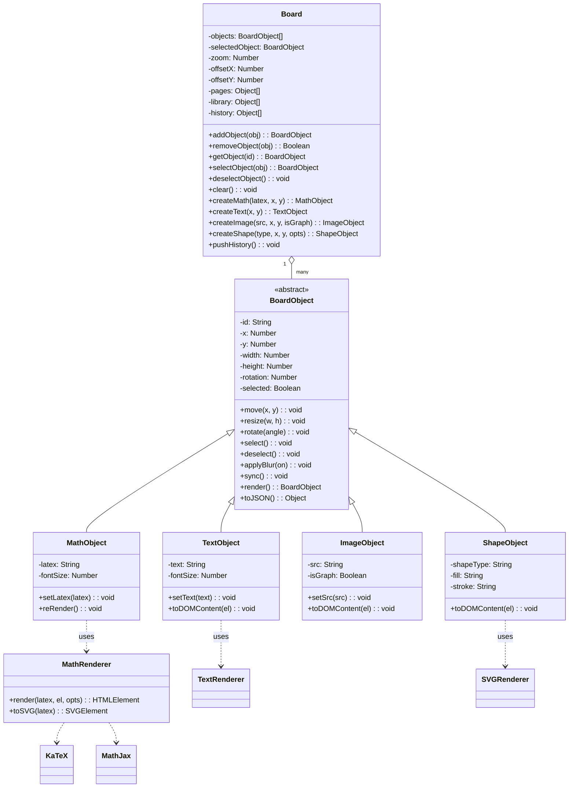

# UML de Classes

## Diagrama Mermaid



## Diagrama em tabela

Visão do diagrama em formato de tabela para melhor legibilidade. As colunas
mostram, por classe, os **atributos**, **métodos** e **relacionamentos**.

### Classes do modelo

| Classe | Estereótipo | Atributos | Métodos | Relacionamentos |
| --- | --- | --- | --- | --- |
| `BoardObject` | `<<abstract>>` | `- id: String` · `- x/y: Number` · `- width/height: Number` · `- rotation: Number` · `- selected: Boolean` | `+ move()` · `+ resize()` · `+ rotate()` · `+ select()` · `+ deselect()` · `+ applyBlur()` · `+ sync()` · `+ render()` · `+ toJSON()` | **superclasse** (classe base) |
| `MathObject` | — | `- latex: String` · `- fontSize: Number` | `+ setLatex()` · `+ reRender()` | **herda** de `BoardObject` |
| `TextObject` | — | `- text: String` · `- fontSize: Number` | `+ setText()` · `+ toDOMContent()` | **herda** de `BoardObject` |
| `ImageObject` | — | `- src: String` · `- originalSrc: String` · `- isGraph: Boolean` · `- graphSpec: Object` · `- naturalWidth/Height: Number` · `- renderedScale: Number` | `+ resize()` · `+ setSrc()` · `+ toDOMContent()` · `+ requiredScale()` · `+ needsRerender()` · `+ rerender()` | **herda** de `BoardObject` |
| `ShapeObject` | — | `- shapeType: String` · `- fill: String` · `- stroke: String` | `+ toDOMContent()` | **herda** de `BoardObject` |
| `Board` | — | `- objects: BoardObject[]` · `- selectedObject` · `- zoom: Number` · `- offsetX/offsetY: Number` · `- pages: Object[]` · `- library: Object[]` · `- history: Object[]` | `+ addObject()` · `+ removeObject()` · `+ getObject()` · `+ selectObject()` · `+ deselectObject()` · `+ clear()` · `+ createMath()/createText()/createImage()/createShape()` · `+ pushHistory()` | **compõe** `1..*` `BoardObject` |

### Renderizadores

| Classe | Estereótipo | Atributos | Métodos | Relacionamentos |
| --- | --- | --- | --- | --- |
| `MathRenderer` | — | — | `+ render()` · `+ toSVG()` | usado **por** `MathObject` (dependência); delega a `KaTeX`/`MathJax` |
| `TextRenderer` | — | — | `+ applyText()` · `+ measureText()` · `+ wrapText()` | usado **por** `TextObject` (dependência) |
| `SVGRenderer` | — | *(métodos estáticos)* | `+ svgContainer()` · `+ createShape()` · `+ renderShape()` · `+ serialize()` | usado **por** `ShapeObject` (dependência) |

### Resumo dos relacionamentos

| Relação | Origem | Destino | Cardinalidade |
| --- | --- | --- | --- |
| Herança | `BoardObject` —▶ `MathObject`, `TextObject`, `ImageObject`, `ShapeObject` | 1 → 4 subclasses |
| Composição | `Board` o— `BoardObject` | `1..*` objetos |
| Dependência | `MathObject` ⇢ `MathRenderer` | 1 → 1 |
| Dependência | `TextObject` ⇢ `TextRenderer` | 1 → 1 |
| Dependência | `ShapeObject` ⇢ `SVGRenderer` | 1 → 1 |
| Delegação | `MathRenderer` ⇢ `KaTeX` / `MathJax` | 1 → 2 (fallback) |

## Diagrama ASCII

```
┌──────────────────────────────────────┐
│             <<abstract>>             │
│              BoardObject             │
├──────────────────────────────────────┤
│ - id: String                         │
│ - x: Number                          │
│ - y: Number                          │
│ - width: Number                      │
│ - height: Number                     │
│ - rotation: Number                   │
│ - selected: Boolean                  │
├──────────────────────────────────────┤
│ + move(x, y): void                   │
│ + resize(w, h): void                 │
│ + rotate(angle): void                │
│ + select(): void                     │
│ + deselect(): void                   │
│ + applyBlur(on): void                │
│ + sync(): void                       │
│ + render(): BoardObject              │
│ + toJSON(): Object                   │
└─────────────────┬────────────────────┘
                  │
          herança │
     ┌────────────┼─────────────┬──────────────┐
     │            │             │              │
     ▼            ▼             ▼              ▼
┌──────────┐ ┌──────────┐ ┌────────────┐ ┌────────────┐
│MathObject│ │TextObject│ │ImageObject │ │ShapeObject │
├──────────┤ ├──────────┤ ├────────────┤ ├────────────┤
│- latex   │ │- text    │ │- src       │ │- shapeType │
│- fontSize│ │- fontSize│ │- isGraph   │ │- fill      │
└────┬─────┘ └──────────┘ └────────────┘ │- stroke    │
     │                                   └────────────┘
     │
     ▼
┌──────────────────┐
│  MathRenderer    │
├──────────────────┤
│ + render()       │
│ + toSVG()        │
└────────┬─────────┘
         │
     ┌───┴────┐
     ▼        ▼
┌────────┐ ┌─────────┐
│ KaTeX  │ │ MathJax │
└────────┘ └─────────┘

┌──────────────────────────────────────┐
│                Board                 │
├──────────────────────────────────────┤
│ - objects: BoardObject[]             │
│ - selectedObject: BoardObject        │
│ - zoom: Number                       │
│ - offsetX: Number                    │
│ - offsetY: Number                    │
│ - pages: Object[]                    │
│ - library: Object[]                  │
│ - history: Object[]                  │
├──────────────────────────────────────┤
│ + addObject() / removeObject()       │
│ + getObject() / selectObject()       │
│ + deselectObject() / clear()         │
│ + createMath/Text/Image/Shape()      │
│ + pushHistory()                      │
└──────────────────┬───────────────────┘
                   │
                   │ contém 1..*
                   ▼
            BoardObject[]
```

## Views e Controllers (Complementares)

As views e controllers **não herdam** do modelo; eles o consomem.

```
User → ToolbarView → ToolController ──▶ Board (Model)
User → Canvas ----> MouseController ──▶ Board (desenho/blur)
User → Modais ----> MathEditorView ──▶ ObjectController ──▶ Board
User → Lousa ------> BoardView + SelectionView ──▶ Board.objects
       ↑
       └── renderizado a partir do Board
```

## Ciclo de vida de um objeto

```
ObjectController.createEquation(latex, x, y)
   → Board.createMath(...)            # cria o modelo
   → BoardView.addObjectElement(obj)  # cria o DOM
   → ObjectController.onCommit()      # salva histórico
```

```
SelectionView (drag/resize)
   → obj.move()/obj.resize()          # atualiza o modelo (getters/setters sync)
   → onCommitChange()                 # salva histórico
```
